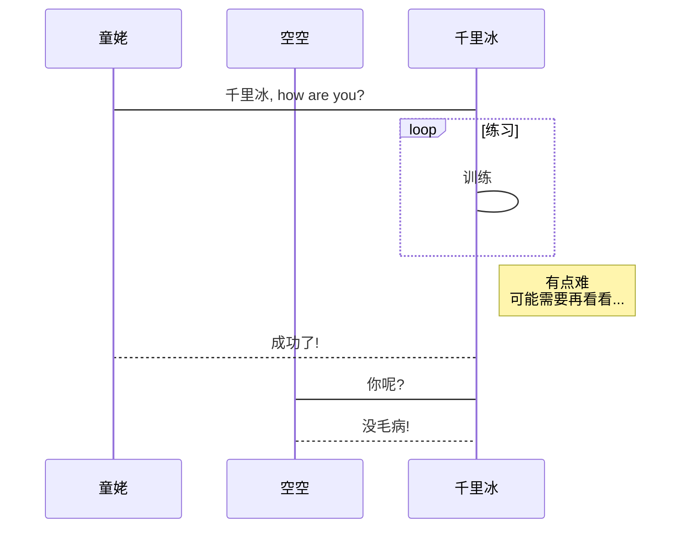

# Mermaid

<https://plugins.gitbook.com/plugin/mermaid-gb3>

使用 mermaid 绘图

```json
"plugins": [
    "mermaid-gb3"
]
```

## 示例

代码：

    ```mermaid
    sequenceDiagram
        participant 童姥
        participant 空空
        童姥->千里冰: 千里冰, how are you?
        loop 练习
            千里冰->千里冰: 训练
        end
        Note right of 千里冰: 有点难 <br/> 可能需要再看看...
        千里冰-->童姥: 成功了!
        千里冰->空空: 你呢?
        空空-->千里冰: 没毛病!
    ```

> 具体语法请参考 <https://mermaidjs.github.io/>

效果：

